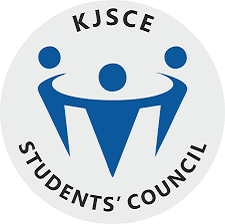

-----

**Sports Secretary, KJSCE Students' Council**
#### June 2017 - June 2018 | Mumbai, India

-----
* Was responsible for all the sporting activities of the college and helped budding sportsmen prove their talent in state and national level competitions
* Galvanized all the sports teams of the college to participate in competitions across the country
* Established an intra-departmental competition to increase participation from students across the college
* Introduced Kabaddi and Kho-Kho which proved to be successful sports for the college  

-----

**Team Lead, KJSCE Skream**
#### September 2017 - January 2018 | Mumbai, India

-----
* Led a team of over 200 students at a national level sports festival – Skream ‘18
* Acted as a liaison between administrative staff and the organizing committee
* Used Google Analytics and Facebook Insights to understand the needs of sponsors and participants
* Saw an increase in the sponsor count from 50 to 75 and the number of particpants from 2500 to 4000 from the previous year
* We managed to raise our profits by almost 15%  

-----

**Convener, KJSCE Parvaah**
#### June 2016 - June 2019 | Mumbai, India

-----
* Championed for the rights of the LGBTQ+ community in Mumbai through pride walks, cycle rallies and workshops
* Spread awareness about health and sanitation by attending regular beach cleanups and by beautifying a railway station in Mumbai, India  

-----

**NSS Special Camp, Amrita College of Engineering**
#### June 2016 - Septmeber 2020 | Coimbatore, India

-----
* Creating avarness on importance of classifying waste and setting up waste management unit in neighboring village
* Created short videos on environmental issues, importance of schooling and demerits of school
dropouts were screened to students and parents in nearby village
* Encouraged blood donation and perform eye checkup to under previlages community in Ettimadai district  
[Report 1](https://intranet.cb.amrita.edu/sites/default/files/SPECIAL_CAMP_2016_2017_unit_2.pdf)  
[Report 2](https://intranet.cb.amrita.edu/sites/default/files/NSS_SPECIAL_CAMP_2020_REPORT_UNIT-2.pdf)

-----
